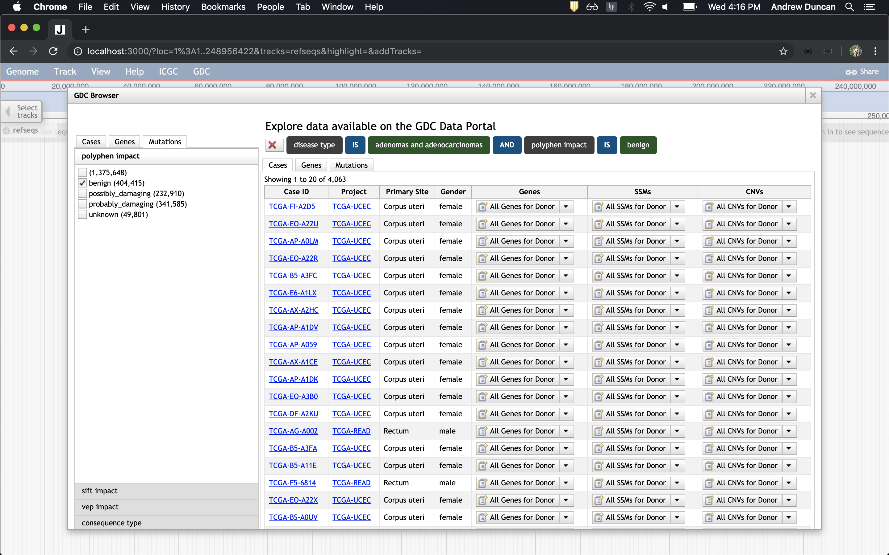

[](https://travis-ci.org/agduncan94/gdc-viewer)
# GDC JBrowse Plugin
A plugin for [JBrowse](https://jbrowse.org/) for viewing [GDC](https://gdc.cancer.gov/) data. For any bugs, issues, or feature recommendations please create an issue through GitHub.

# Installation and Setup
## 1. Install JBrowse
Quick setup of JBrowse - https://github.com/GMOD/jbrowse/#install-jbrowse-from-github-for-developers

## 2. Install Plugin
See [JBrowse - Installing Plugins](https://jbrowse.org/docs/plugins.html) for a general approach to installing plugins.

For installing gdc-viewer plugin:
1. Copy the gdc-viewer folder into the JBrowse `plugins` directory.
2. Add 'gdc-viewer' to the array of plugins in the `jbrowse_conf.json`.

## 3. Install Reference Sequence Data
Now setup the reference sequence used. GDC requires the GRCh38 Human reference files.

Download the GRCh38 `.fa` and `.fa.fai` files online (ex. http://bioinfo.hpc.cam.ac.uk/downloads/datasets/fasta/grch38/). Then put the following in `./data/tracks.conf` (note files may be named something else).

```
refSeqs=GRCh38.genome.fa.fai
  
[tracks.refseqs]
urlTemplate=GRCh38.genome.fa
```

## 4. Adding new tracks
We have some basic example tracks in `data/tracks.conf`. You can also add new tracks by using the GDC dialog accessible within JBrowse. These are present in the menu under `GDC`. See [Dynamic Track Generation](#dynamic-track-generation) for more details.

## 5. Run JBrowse
You'll have to run the following commands:

```
./setup.sh
utils/jb_run.js -p 3000
```

JBrowse should now be running with the GDC Plugin working!

# JBrowse configuration
## Faceted Track Selector
Add the following to your jbrowse.conf to use the faceted track selector.
```
[trackSelector]
type = Faceted
displayColumns =
  + label
  + key
  + datatype
  + case
  + project
  + primarySite
```

Note that this will only show preloaded tracks as well as tracks you have added using the various dialogs. It does not dynamically create tracks based on what is available from the GDC.

# Available Store SeqFeature
## A note on filters
All SeqFeatures support filters as they are defined in the [GDC API Documentation](https://docs.gdc.cancer.gov/API/Users_Guide/Search_and_Retrieval/#filters-specifying-the-query).

Note that filters should have the filter type prepended to the front. Ex. Case filters use `cases.`, SSM filters use `ssms.`, and Gene filters use `genes.`. GraphQL is used to retrieve results, so if the filters work there, they work with these Store classes.

The following shows a filter for cases by ethnicity:
```
{
  "op":"in",
  "content":{
    "field":"cases.demographic.ethnicity",
    "value":[
      "hispanic or latino"
    ]
  }
}
```

You can view/edit the filters associated with a track by clicking the down arrow for the track menu and selecting `View Applied Filters`. Be careful, there are currently no checks to see if the filters are valid before applying them.

## Genes
A simple view of all of the genes seen across all cases.

You can view case specific genes by setting the `case` field.

You can apply filters to the track too, in the same format as GDC. The below example only shows Genes whose biotype is not 'protein_coding'.

```
{ 
   "op":"!=",
   "content":{ 
      "field":"cases.biotype",
      "value":"protein_coding"
   }
}
```

To put it in the track config you may want to minimize it as such:
```
filters={"op":"!=","content":{"field":"cases.biotype","value":"protein_coding"}}
```

Example Track:
```
[tracks.GDC_Genes]
storeClass=gdc-viewer/Store/SeqFeature/Genes
type=JBrowse/View/Track/GeneTrack
key=GDC Genes
metadata.datatype=Gene
filters={"op":"!=","content":{"field":"cases.biotype","value":"protein_coding"}}
```


### Extra notes
You can set the max number of genes to return with the `size` field (per panel). It defaults to 100. The smaller the number, the faster the results will appear.

## SSMs
A simple view of all of the simple somatic mutations seen across all cases.

You can view case specific SSMs by setting the `case` field.

You can apply filters to the track too, in the same format as GDC. The below example only shows SSMs whose reference allele is 'G'.
```
{ 
   "op":"=",
   "content":{ 
      "field":"ssms.reference_allele",
      "value":"G"
   }
}
```

To put it in the track config you may want to minimize it as such:
```
filters={"op":"=","content":{"field":"ssms.reference_allele","value":"G"}}
```

Example Track:
```
[tracks.GDC_SSM]
storeClass=gdc-viewer/Store/SeqFeature/SimpleSomaticMutations
type=gdc-viewer/View/Track/SSMVariants
key=GDC SSM
metadata.datatype=SSM
filters={"op":"=","content":{"field":"ssms.reference_allele","value":"G"}}
```


### Extra notes
You can set the max number of SSMs to return with the `size` field (per panel). It defaults to 100. The smaller the number, the faster the results will appear.

## CNVs
A simple view of all of the CNVs seen across all cases.

You can view case specific CNVs by setting the `case` field.

You can apply filters to the track too, in the same format as GDC. The below example only shows CNVs that are 'Gains'.
```
{ 
   "op":"=",
   "content":{ 
      "field":"cnv_change",
      "value":[ 
         "Gain"
      ]
   }
}
```

To put it in the track config you may want to minimize it as such:
```
filters={"op":"=","content":{"field":"cnv_change","value":["Gain"]}}
```

Example Track:
```
[tracks.GDC_CNV]
storeClass=gdc-viewer/Store/SeqFeature/CNVs
type=gdc-viewer/View/Track/CNVTrack
key=GDC CNV
metadata.datatype=CNV

```


### Extra notes
You can set the max number of CNVs to return with the `size` field (per panel). It defaults to 500. The smaller the number, the faster the results will appear.

# Dynamic Track Generation
## Explore cases, genes and mutations
This dialog is similar to the Exploration section of the GDC data portal. As you apply facets on the left-hand side, updated results will be shown on the right side. You can create donor specific SSM, Gene, and CNV tracks, along with GDC-wide SSM, Gene and CNV tracks.


## Explore Projects
This dialog shows the projects present on the GDC Data Portal. You can add SSM, Gene, and CNV tracks for each project.


## Explore Primary Sites
This dialog shows the primary sites present on the GDC Data Portal. You can add SSM, Gene, and CNV tracks for each primary site.


# Export Types
The following export types are supported by both GDC Genes and SSMs. To export, select `Save track data` in the track dropdown. Note that not all track information is carried over to the exported file.
* BED
* GFF3
* Sequin Table
* CSV
* Track Config

# Automated testing
Cypress.io is used for testing this plugin. The following steps show how to run the tests locally.
1. Install JBrowse but don't install chromosome files.
2. Download Chr 1 fasta from `http://ftp.ensembl.org/pub/release-94/fasta/homo_sapiens/dna/Homo_sapiens.GRCh38.dna.chromosome.1.fa.gz`. There should be the fasta index file in `cypress/data/Homo_sapiens.GRCh38.dna.chromosome.1.fa.fai`. Put these files into `jbrowse/data/`.
3. Install Cypress.io with `npm install`.
4. Place `cypress/data/tracks.conf` into your `jbrowse/data/` directory. Make sure no other tracks are present.
5. Run `npx cypress open` or `npx cypress run` or `npm run e2e`

**Note** while some tests have mocked endpoints, not all endpoints are mocked. This could lead to breakage of tests in the future.