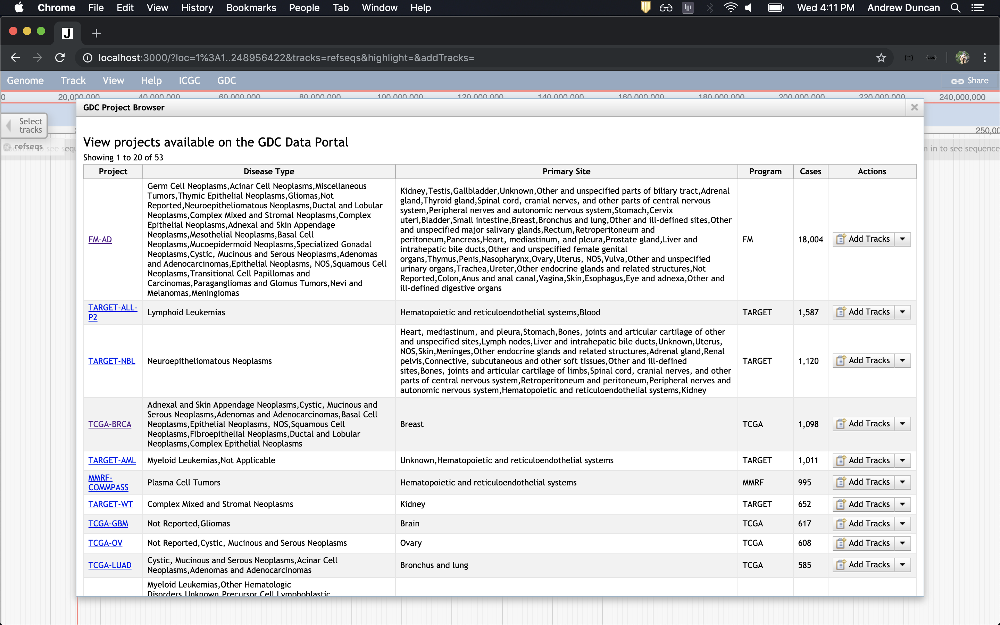

# Tracks
{: .no_toc }

Create Mutation (SSM), Gene, and CNV tracks using a dynamic track generator
{: .fs-6 .fw-300 }

## Table of contents
{: .no_toc .text-delta }

1. TOC
{:toc}

# Filters
All tracks support filters as they are defined in the [GDC API Documentation](https://docs.gdc.cancer.gov/API/Users_Guide/Search_and_Retrieval/#filters-specifying-the-query).

Note that filters should have the filter type prepended to the front. Ex. Case filters use `cases.`, Mutation filters use `ssms.`, and Gene filters use `genes.`. GraphQL is used to retrieve results, so if the filters work there, they work with these Store classes.

The following shows a filter for cases by ethnicity:
```
{
  "op":"in",
  "content":{
    "field":"cases.demographic.ethnicity",
    "value":[
      "hispanic or latino"
    ]
  }
}
```

You can view/edit the filters associated with a track by clicking the down arrow for the track menu and selecting `View Applied Filters`. Be careful, there are currently no checks to see if the filters are valid before applying them.

# Available Track Types

## Genes
A simple view of all of the genes seen across all cases.

You can view case specific genes by setting the `case` field. Multiple cases are supported by using commas.

You can apply filters to the track too, in the same format as GDC. The below example only shows Genes whose biotype is not 'protein_coding'.

```
{ 
   "op":"!=",
   "content":{ 
      "field":"genes.biotype",
      "value":"protein_coding"
   }
}
```

To put it in the track config you may want to minimize it as such:
```
filters={"op":"!=","content":{"field":"genes.biotype","value":"protein_coding"}}
```

Example Track:
```
[tracks.GDC_Genes]
storeClass=gdc-viewer/Store/SeqFeature/Genes
type=JBrowse/View/Track/GeneTrack
key=GDC Genes
metadata.datatype=Gene
filters={"op":"!=","content":{"field":"genes.biotype","value":"protein_coding"}}
```


### Extra notes
{: .no_toc }
You can set the max number of genes to return with the `size` field (per panel). It defaults to 100. The smaller the number, the faster the results will appear.

## Mutations (SSMs)
A simple view of all of the simple somatic mutations seen across all cases.

You can view case specific mutations by setting the `case` field. Multiple cases are supported by using commas.

You can apply filters to the track too, in the same format as GDC. The below example only shows mutations whose reference allele is 'G'.
```
{ 
   "op":"=",
   "content":{ 
      "field":"ssms.reference_allele",
      "value":"G"
   }
}
```

To put it in the track config you may want to minimize it as such:
```
filters={"op":"=","content":{"field":"ssms.reference_allele","value":"G"}}
```

Example Track:
```
[tracks.GDC_SSM]
storeClass=gdc-viewer/Store/SeqFeature/SimpleSomaticMutations
type=gdc-viewer/View/Track/SSMVariants
key=GDC SSM
metadata.datatype=SSM
filters={"op":"=","content":{"field":"ssms.reference_allele","value":"G"}}
```


### Extra notes
{: .no_toc }
You can set the max number of mutations to return with the `size` field (per panel). It defaults to 100. The smaller the number, the faster the results will appear.

## CNVs
A simple view of all of the CNVs seen across all cases.

You can view case specific CNVs by setting the `case` field. Multiple cases are supported by using commas.

You can apply filters to the track too, in the same format as GDC. The below example only shows CNVs that are 'Gains'.
```
{ 
   "op":"=",
   "content":{ 
      "field":"cnv_change",
      "value":[ 
         "Gain"
      ]
   }
}
```

To put it in the track config you may want to minimize it as such:
```
filters={"op":"=","content":{"field":"cnv_change","value":["Gain"]}}
```

Example Track:
```
[tracks.GDC_CNV]
storeClass=gdc-viewer/Store/SeqFeature/CNVs
type=gdc-viewer/View/Track/CNVTrack
key=GDC CNV
metadata.datatype=CNV

```


### Extra notes
{: .no_toc }
You can set the max number of CNVs to return with the `size` field (per panel). It defaults to 500. The smaller the number, the faster the results will appear.

# Dynamic Track Generation
## Explore cases, genes and mutations
This dialog is similar to the Exploration section of the GDC data portal. As you apply facets on the left-hand side, updated results will be shown on the right side. You can create case specific Mutation, Gene, and CNV tracks, along with GDC-wide Mutation, Gene and CNV tracks.

You can optionally apply the current facets to the track itself when you add a track. For example, say you have applied the facet VEP impact of high. On the `Mutations` tab there is the option to add all mutations from the GDC or add all filtered mutations from the GDC. The first option will create a track with all mutations present on the GDC portal (no filtering). The second option will create a track with only mutations that have a VEP impact of high. As you can see, this becomes very powerful when you combine multiple facets.


## Explore Projects
This dialog shows the projects present on the GDC Data Portal. You can add Mutation, Gene, and CNV tracks for each project.




## Explore Primary Sites
This dialog shows the primary sites present on the GDC Data Portal. You can add Mutation, Gene, and CNV tracks for each primary site.


# Export Types
The following export types are supported by both GDC Genes and Mutations. To export, select `Save track data` in the track dropdown. Note that not all track information is carried over to the exported file.
* BED
* GFF3
* Sequin Table
* CSV
* Track Config